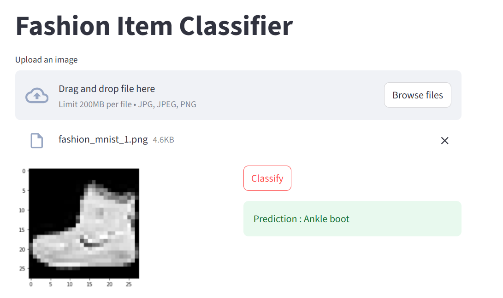

# 👕 Fashion Item Classifier

A deep learning-powered web application that classifies fashion items from uploaded images using a Convolutional Neural Network (CNN). The application is built with **TensorFlow**, **Keras**, and **Streamlit**, providing an intuitive interface for real-time image classification.

---

## 🚀 Features

- Upload an image of a fashion item.
- Automatic image preprocessing.
- Real-time prediction using a trained CNN model.
- User-friendly Streamlit interface.
- Lightweight and easy to deploy.
- Docker support included.

---

## 🛠️ Tech Stack

- Python
- TensorFlow
- Keras
- Streamlit
- NumPy
- Pillow
- Docker

---

## 📂 Project Structure

```
Fashion model/
│
├── app/
│   ├── main.py
│   ├── requirements.txt
│   ├── Dockerfile
│   └── trained_model/
│       └── fashion_savedmodel/
│
├── model_training_notebook/
│   └── Fashion_Dataset.ipynb
│
├── test_images/
│
├── test.py
└── README.md
```

---

## 🧠 Model

The model is a Convolutional Neural Network (CNN) trained on the Fashion MNIST dataset.

### Dataset Classes

| Label | Class |
|-------|----------------|
| 0 | T-shirt / Top |
| 1 | Trouser |
| 2 | Pullover |
| 3 | Dress |
| 4 | Coat |
| 5 | Sandal |
| 6 | Shirt |
| 7 | Sneaker |
| 8 | Bag |
| 9 | Ankle Boot |

---

## ⚙️ Installation

### Setup Instructions

Navigate to the app directory:

```bash
cd app
```

### Create Virtual Environment

Windows

```bash
python -m venv venv
venv\Scripts\activate
```

Linux / macOS

```bash
python3 -m venv venv
source venv/bin/activate
```

### Install Dependencies

```bash
pip install -r requirements.txt
```

---

## ▶️ Run the Application

```bash
streamlit run main.py
```

The application will open at

```
http://localhost:8501
```

---

## 🐳 Docker

Build the Docker image

```bash
docker build -t fashion-classifier .
```

Run the container

```bash
docker run -p 8501:8501 fashion-classifier
```

---

## 📷 How It Works



1. Upload a fashion image.
2. The image is resized to **28 × 28** pixels.
3. Converted to grayscale.
4. Pixel values are normalized.
5. Passed to the trained CNN.
6. The predicted class is displayed.

---


## 📈 Future Improvements

- Confidence score for predictions.
- Support for multiple image uploads.
- Improved CNN architecture.
- Mobile-friendly UI.
- Deploy using Docker on cloud platforms.

---

